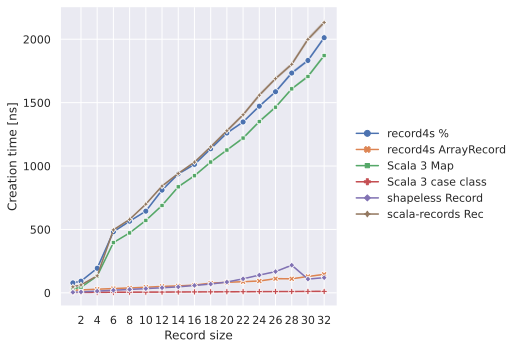
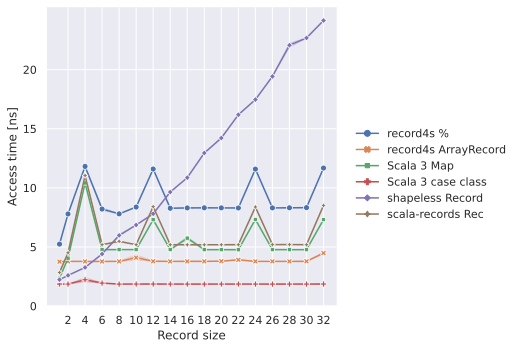
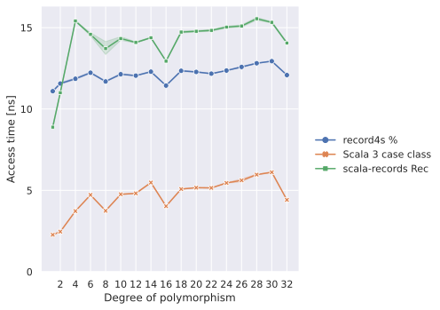
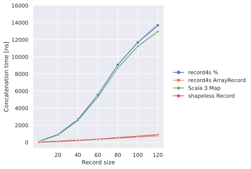
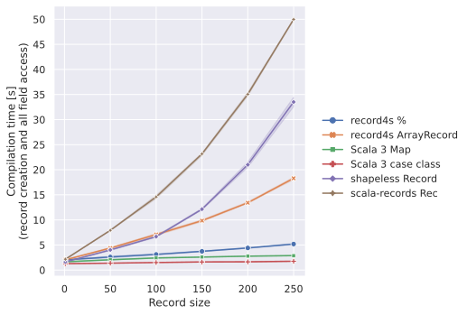
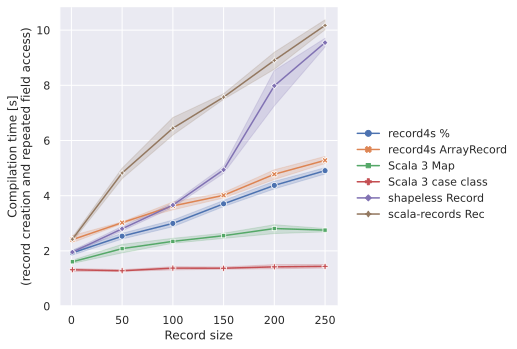
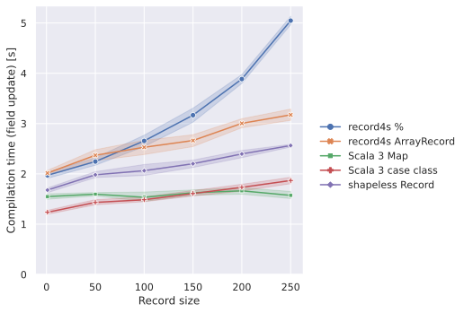
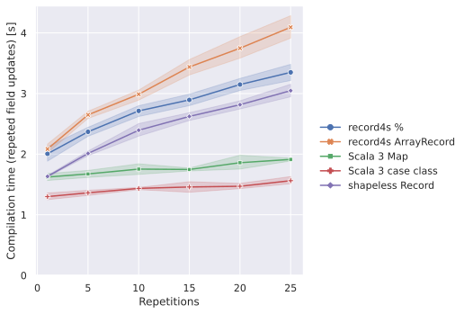

Full Benchmark Result
=====================

The source code of the benchmarks is available in the following directories:

- [record4s %](https://github.com/tarao/record4s/tree/master/modules/benchmark_3/src/main/scala/benchmark/record4s)
- [record4s ArrayRecord](https://github.com/tarao/record4s/tree/master/modules/benchmark_3/src/main/scala/benchmark/record4s_arrayrecord)
- [Scala 3 Map](https://github.com/tarao/record4s/tree/master/modules/benchmark_3/src/main/scala/benchmark/map)
- [Scala 3 case class](https://github.com/tarao/record4s/tree/master/modules/benchmark_3/src/main/scala/benchmark/caseclass)
- [shapeless Record](https://github.com/tarao/record4s/tree/master/modules/benchmark_2_13/src/main/scala/benchmark/shapeless)
- [scala-records Rec](https://github.com/tarao/record4s/tree/master/modules/benchmark_2_11/src/main/scala/benchmark/scalarecords)

See [Performance][] for the discussion on the benchmark results.

Runtime metrics
---------------

### Runtime metrics from [[Karlsson '18][]]

### Other runtime metrics

Compile-time metrics
--------------------

### Compile-time metrics from [[Karlsson '17]]

### Compile-time metrics from [scala-records-benchmarks]

### Other compile-time metrics

[Karlsson '17]: https://www.diva-portal.org/smash/get/diva2:1123270/fulltext01.pdf
[Karlsson '18]: https://www.csc.kth.se/~phaller/doc/karlsson-haller18-scala.pdf
[scala-records-benchmarks]: https://github.com/scala-records/scala-records-benchmarks
