Performance
===========

Internal Representation
-----------------------

Record fields are internally stored in a @:api(scala.collection.immutable.Map).  Roughly
saying, field access `r.f` translates to `r.__data("f")` at compile time, where `r.__data`
is the internal @:api(scala.collection.immutable.Map).  In the next two sections, we
describe the overheads compared to `Map`.

Runtime Overhead
----------------

The runtime performance characteristics of records are almost the same as those of
@:api(scala.collection.immutable.Map)s.

Time consumption of creating a new instance grows linearly against the number of fields.
This is due to hash map construction.  There is a few overhead in record creation.  It
comes from the difference between `Map.empty.concat(fields)` and `Map.from(fields)`.

| 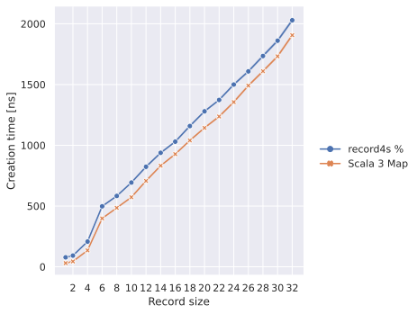 |
| ------------------------------------------------------------------ |
| Record creation time against record size                           |

Field access takes effectively constant time. There is some more additional overheads in
records because [we need some field label decoding][*1].

|  |
| ----------------------------------------------------------------------- |
| Field access time against record size                                   |

[*1]: https://github.com/tarao/record4s/pull/16

Compile-time Overhead
---------------------

Compilation of reacord creation and update have some overheads.  They need to calculate
structural types from field types and argument types.

| 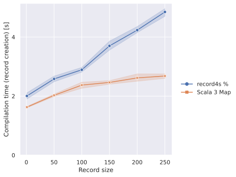 |
| -------------------------------------------------------------------------------------------- |
| Compilation time of record creation against record size                                      |

Compilation time of field update grows quadratically against record size.  This is due to
subtyping checks of structural types in Scala 3 compiler, which is done by heavy recursive
calls.

|  |
| ---------------------------------------------------------------------------------------- |
| Compilation time of update against record size                                           |

Compilation of field access on records somehow faster than on
@:api(scala.collection.immutable.Map)s.  We have no idea why this is faster than
@:api(scala.collection.immutable.Map).

|  |
| ------------------------------------------------------------------------------------------------- |
| Compilation time of field access against record size                                              |

Comparison with Case Classes
----------------------------

Case classes have always better performance both at runtime and compile time (except
runtime performance of field updates).

Here's the comparison of runtime performance.  Creation time and access time of case
classes are constant time while update time grows significantly when the number of fields
gets large.  This is because updating a case class (by `copy` method) copies the entire
instance of the case class.

| 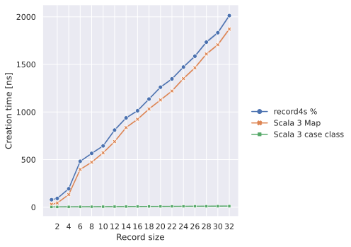 |
| -------------------------------------------------------------------- |
| Record creation time against record size                             |

| 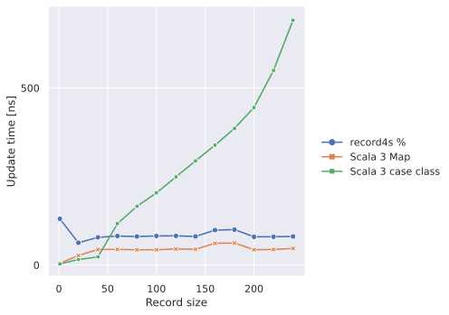 |
| ---------------------------------------------------------------- |
| Update time against record size                                  |

| 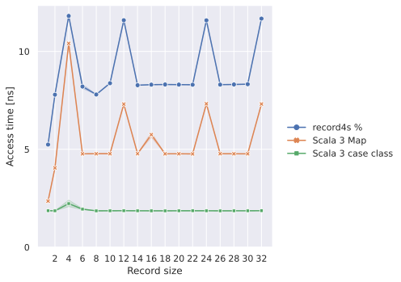 |
| ------------------------------------------------------------------------- |
| Field access time against record size                                     |

Faster field access
-------------------

If you are a speed freak, you may wish to have a field access which takes strictly
constant time, like with case classes or structural types in some other languages, for
example in [Go][].

[Go]: https://go.dev/

Such implementation usually allocates fields in a specific order and compiles a field
access to an index lookup.  It is theoretically hard to achieve this with our structural
types of records, where the order of fields is insignificant and it has implicit upcasts.

We have another record type called `ArrayRecord` for this motivation.  It provides
constant-time field access with fixed-order field types and without implicit upcasts.

```scala mdoc:mline
import com.github.tarao.record4s.ArrayRecord

val person = ArrayRecord(name = "tarao", age = 3)

person.name
```

In this case, `person.name` compiles to `person.__fields(0)._2.asInstanceOf[String]`.

There is no implicit upcast but we have explicit `upcast` method.

```scala mdoc:fail
val named: ArrayRecord[("name", String) *: EmptyTuple] = person
```

```scala mdoc:mline
val named = person.upcast[("name", String) *: EmptyTuple]
```

Its field access is faster than `%` records or @:api(scala.collection.immutable.Map)s.
Record creation is also quite fast.

| 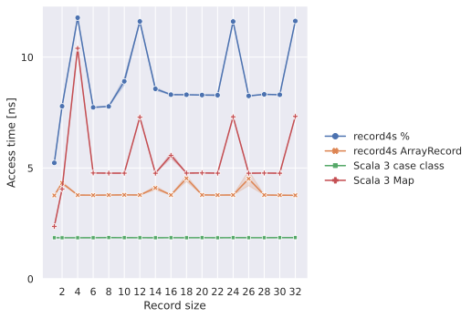 |
| --------------------------------------------------------------------------- |
| Field access time against record size                                       |

| 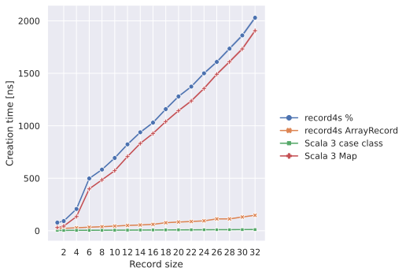 |
| ---------------------------------------------------------------------- |
| Record creation time against record size                               |

On the other hand, be careful that field update gets slow as the number of fields grows
because it requires to make a copy of field slots on update.

| 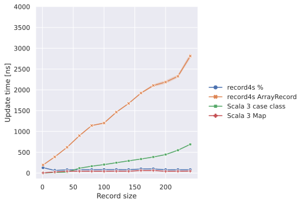 |
| ------------------------------------------------------------------ |
| Update time against record size                                    |

Compilation of field access also takes more time compared to `%` because it requires to
calculate the index of the field from the receiver type.

|  |
| ------------------------------------------------------------------------------------------------- |
| Compilation time of field access against record size                                              |

Comparison with Related Work
----------------------------

In this section, we additionally compare the performance of our records with that of
[shapeless][] records and [scala-records].

[shapeless]: https://github.com/milessabin/shapeless
[scala-records]: https://github.com/scala-records/scala-records

Basically, our `%` records and scala-records have similar performance characteristics
since they are both @:api(scala.collection.immutable.Map)-based, and our `ArrayRecord` and
shapeless records have similar characteristics since they are both order-significant
linearly allocated records.  Note that scala-records have no concatenation and update
operation.

One major difference in shapeless records is that it takes linearly growing time to access
fields as the field index increases while `ArrayRecord` keeps constant time.  This is
because shapeless records have linked list structure while `ArrayRecord`s are indexed
arrays.

| 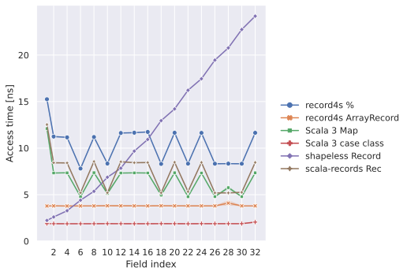 |
| ----------------------------------------------------------- |
| Field access time against field index                       |

Compilation time consumption of shapeless records also grows rapidly for record creation
and concatenation compared to other implementations.

|  |
| -------------------------------------------------------------------------------- |
| Compilation time of record creation against record size                          |

| 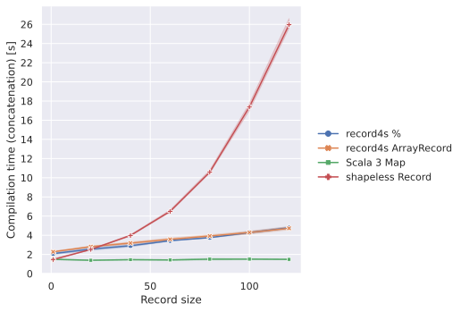 |
| ------------------------------------------------------------------------------------------ |
| Compilation time of record concatenation against record size                               |

Finally, compilation time for field access takes shorter in this order:

> Case classes = `%` < `Map` = scala-records < shapeless records < `ArrayRecord`

| 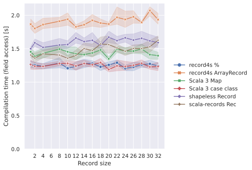 |
| ------------------------------------------------------------------------------------- |
| Compilation time of field access against record size                                  |

Summary of Features and Performance
-----------------------------------

|                                 |Case classes|`Map`|record4s `%`| record4s `ArrayRecord`|shapeless records|scala-records|
|---------------------------------|------------|-----|------------|-----------------------|-----------------|-------------|
|Structural typing                |            |     |✓           |                       |                 |✓            |
|Concatenation                    |            |✓    |✓           |✓                      |✓                |             |
|Update                           |✓           |✓    |✓           |✓                      |✓                |             |
|Fast creation                    |✓           |     |            |✓                      |✓                |             |
|Fast concatenation               |N/A         |     |            |✓                      |✓                |N/A          |
|Fast update                      |            |✓    |✓           |                       |                 |N/A          |
|Fast field access                |✓           |✓    |✓           |✓                      |                 |✓            |
|Strict O(1) field access         |✓           |     |            |✓                      |                 |             |
|Fast compilation of creation     |✓           |✓    |✓           |✓                      |                 |✓            |
|Fast compilation of concatenation|N/A         |✓    |✓           |✓                      |                 |N/A          |
|Fast compilation of update       |✓           |✓    |            |✓                      |✓                |N/A          |
